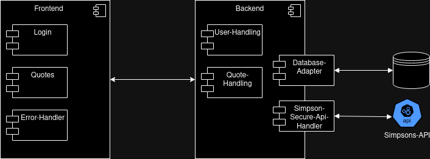

Frontend und Backend werden in zwei einzelne Packages getrennt.

Das Frontend beinhaltet drei Komponenten. 
1. Login-Komponente 
   - View die Username und Passwort entgegen nimmt und an das Backend zur Verifizierung sendet.
   - Bei Erfolg wird die neue Session gespeichert und die Quotes-Komponente geladen.
   - Im Fehlerfall wird der Error-Handler aufgerufen um eine Fehlermeldung, anhand des Backend-Response, anzuzeigen.
2. Quotes-Komponente 
   - Diese fragt die Simpson Quotes ab und zeigt diese an.
3. Error-Handler
   - Zeigt Fehlermeldungen, wie z.B. Login-Fehler, an.

Das Backend besteht aus vier Komponenten.
1. User-Handler
   - Überprüft Login-Versuche.
   - Sendet Session-ID im Erfolgsfall ansonsten eine Fehlermeldung.
2. Quote-Handler
   - Prüft Session-ID.
   - Bei valider Session-ID werden die Quotes zurückgesendet.
   - Bei fehlender, abgelaufener oder falscher Session-ID wird ein Fehler gesendet.
   - Händelt die Quotes in der Datenbank.
   - Holt neue Quotes via Simpson-Secure-Api-Handler
3. Datenbank-Adapter
   - Stellt die Verbindungsschicht zur Datenbank dar
   - Alle Datenbankoperationen werden hier hinterlegt
4. Simpson-Secure-Api-Handler
   - Authentifiziert sich gegenüber der Simpson API
   - Läd Quotes